## Beep
*Easy*

Began with port scanning using rustscan.

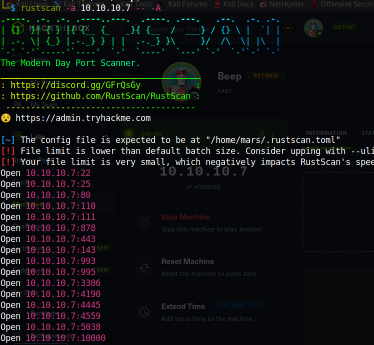

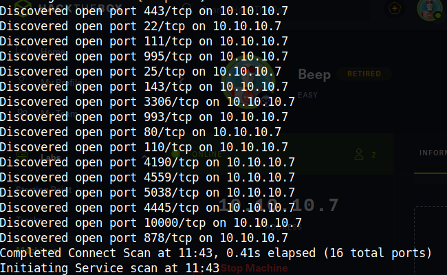

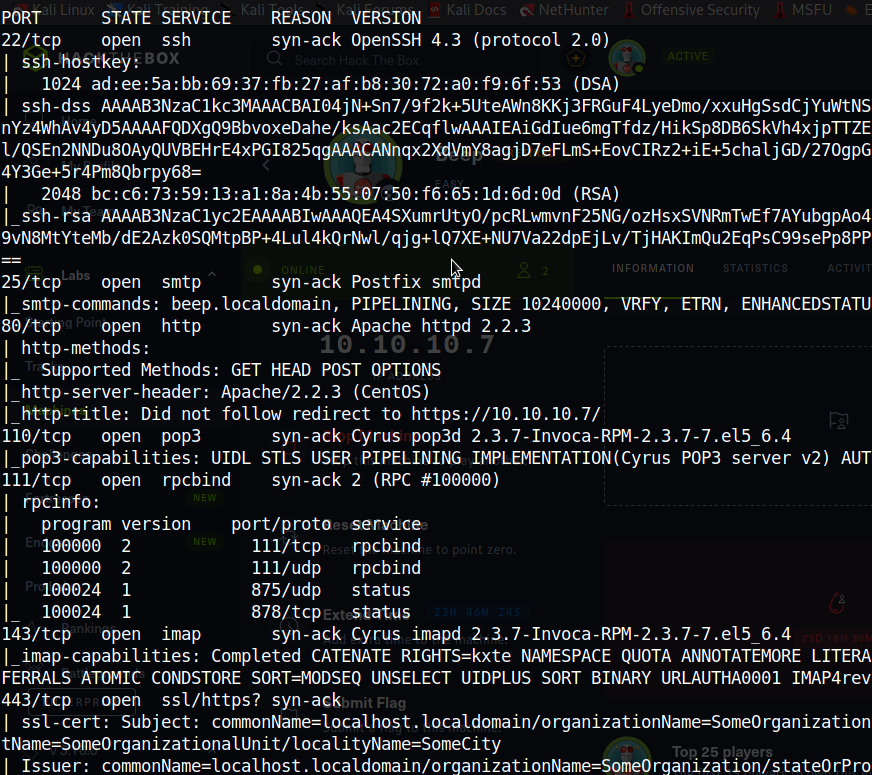

Notice the very old version of Appache that the web service runs on.  Apache/2.2.3 (CentOS) Even browsers these days don;t support such an old version.

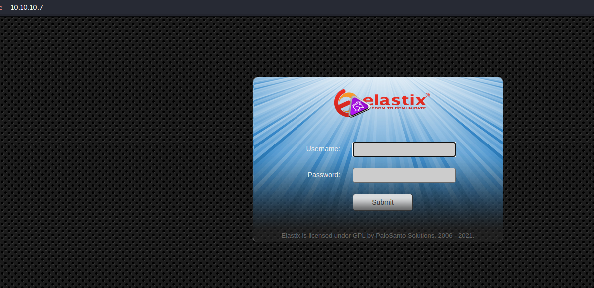

Tried to login using SQL injection, but didn't work.

Did some eneumeration using gobuster. The -k is to bypass certification check and -t 50 is to speed up the process, though it took quite some time :/

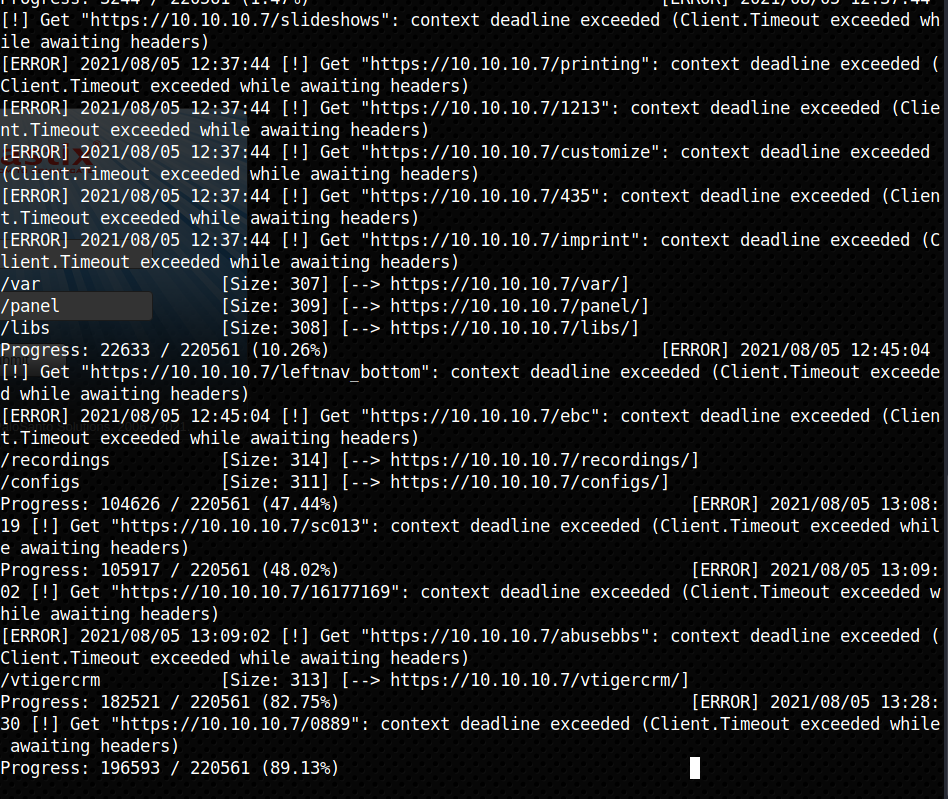

Opened various webpages and finally found /vtigercrm interesting.

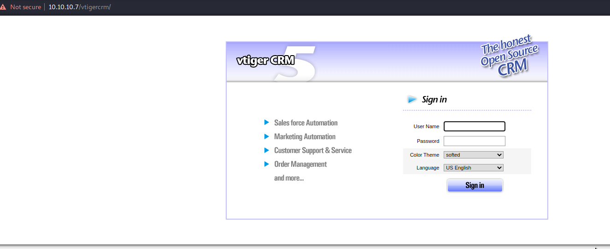

Searching for exploits using searchsploit I searched for Apache/2.2.3 (CentOS), centos, and vtigercrm. Ran out of search terms. So I googled elastix and found exploit in the suggested sersches. So I searched for elastix in searchsploit.

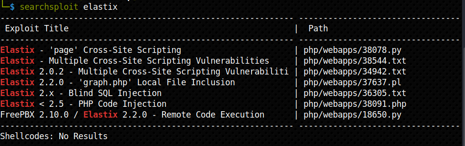

Learnt a little about Local File Inclusion (LFI).
An attacker can use Local File Inclusion (LFI) to trick the web application into exposing or running files on the web server. An LFI attack may lead to information disclosure, remote code execution, or even Cross-site Scripting (XSS). Typically, LFI occurs when an application uses the path to a file as input. If the application treats this input as trusted, a local file may be used in the include statement.
So tried the LFI attack.

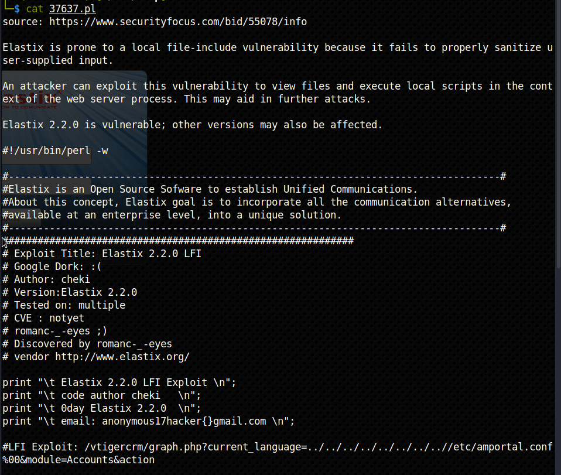

So accordingly my url was https://10.10.10.7/vtigercrm/graph.php?current_language=../../../../../../../..//etc/amportal.conf%00&module=Accounts&action


Then I checked the source code. I found two passwords. Looks like the same password(s) is used in multiple times.

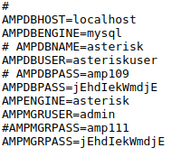

To get the list of users, I need to check /etc/passwd. So my next url was https://10.10.10.7/vtigercrm/graph.php?current_language=../../../../../../../..//etc/passwd%00&module=Accounts&action

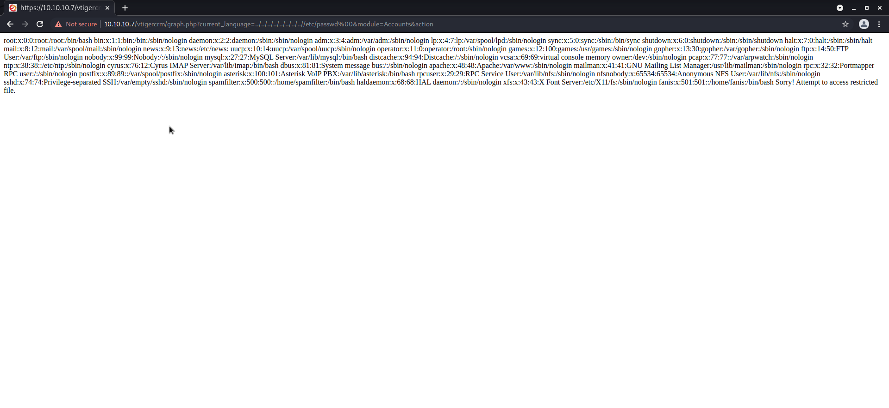

Then I checked the source code, so that things seem more organised.

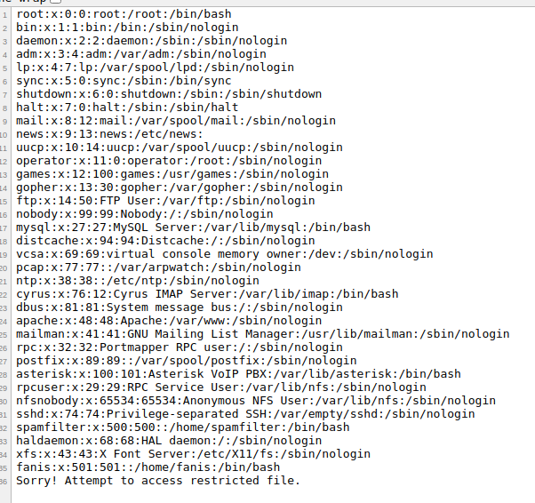

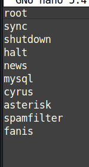

Since I have a list of users and passwords, I can now use hydra to brute force ssh.

```
hydra -L beep-users -P beep-pass ssh://10.10.10.7
```
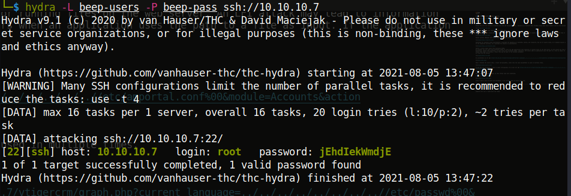

We have the root password!

On logging into ssh, I found this error.
Unable to negotiate with 10.10.10.7 port 22: no matching key exchange method found. Their offer: diffie-hellman-group-exchange-sha1,diffie-hellman-group14-sha1,diffie-hellman-group1-sha1
So from the HTB discussion forum, found that I had to force OpenSSH Client to use a weak cipher.
```
ssh -oKexAlgorithms=+diffie-hellman-group1-sha1 root@10.10.10.7
```
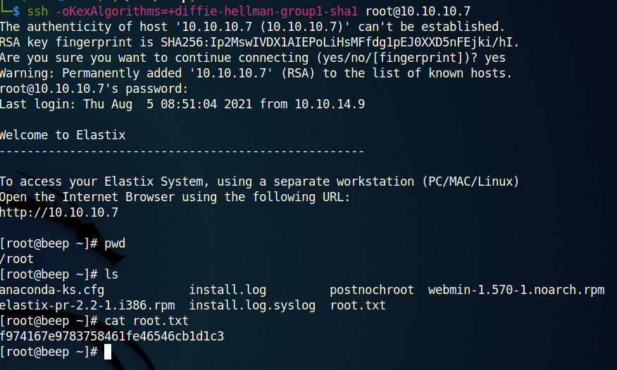

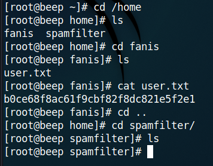

User flag  **b0ce68f8ac61f9cbf82f8dc821e5f2e1**    
Root flag  **f974167e9783758461fe46546cb1d1c3**
