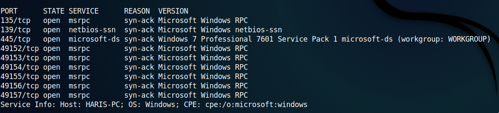
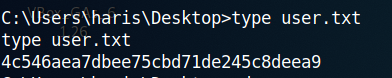

## Blue
*Easy*

Began with scanning for open ports
```
rustscan -a 10.10.10.40 -- -A
```



Didn't find anything useful. So I used metasploit to find the version of SMB. I used [this](https://www.rapid7.com/db/modules/auxiliary/scanner/smb/smb_version/) article.


So I googled 'Windows 7 Professional SP1 (build:7601)' and found [this](https://www.rapid7.com/db/modules/exploit/windows/smb/ms17_010_eternalblue/) article. Looks like our machine is vulnurable to eternal blue.


Ran the exploit and got the meterpreter that too as the administrator.


Got the user flag and root flag.




User flag  **4c546aea7dbee75cbd71de245c8deea9**

Root flag  **ff548eb71e920ff6c08843ce9df4e717**

