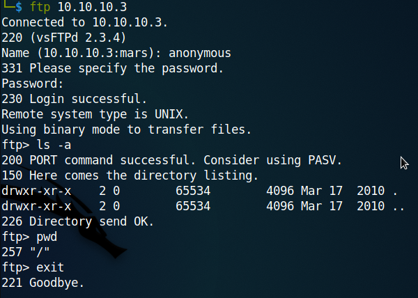
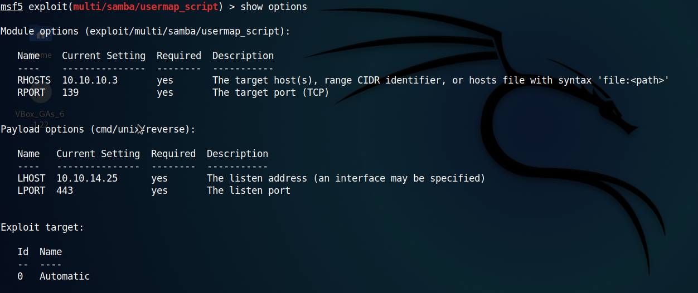
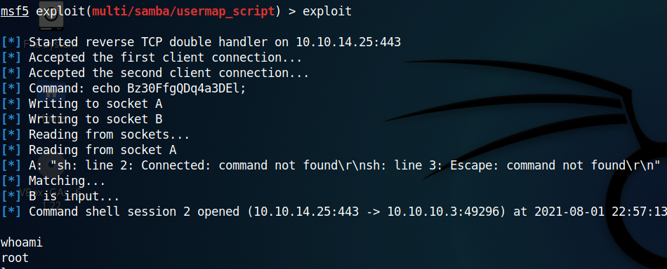

## Lame

To begin with, I scanned for all the open ports.
```
nmap -p- -T4 -Pn 10.10.10.3
```


Since port 21 is open, I checked if anonymous login was available. It was, but didn't find anything of much use :/



Since ports 139 and 445 were open my next option was to use SMB. We may find something there. So to check what I can access without a login, I used smbmap.
```
smbmap -H 10.10.10.3
```
Since we have access to /tmp, I used smbclient to access it.
```
smbclient -N ////10.10.10.3/tmp
```
But this gave an error. "protocol negotiation failed: NT_STATUS_CONNECTION_DISCONNECTED"
I googled the error and found the solution in a HackTheBox discussion forum. The command I then used was

```
smbclient -N ////10.10.10.3/tmp --option='client min protocol=NT1'
```


But again I didn't find anything meaningful. There has to be something I didn't notice. Looking back, I found the SMB version, Samba 3.0.20-Debian, running when I used smbmap. That might be the vulnurability. I googled and found [this](https://www.rapid7.com/db/modules/exploit/multi/samba/usermap_script/) article at rapid7 useful.

Though I referred the above article, I made a few changes. Apart from changing the RHOST and LHOST I made the LPORT 443 and used the payload /cmd/unix/reverse. This is because the previous payload was taking too much time.



The exploit ran quickly and I got the shell, that too as root. No privilage escalation. Easy!




User flag **b1a779a7810447c64526195323b1c2c1**   
Root flag **4da8863dab11977103c07125ef4545c1**

