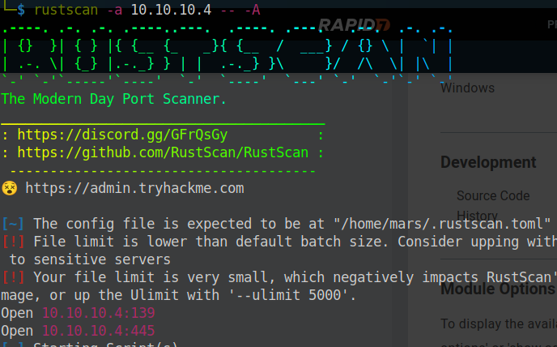
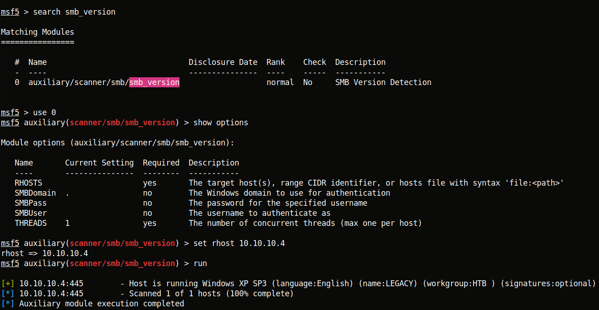
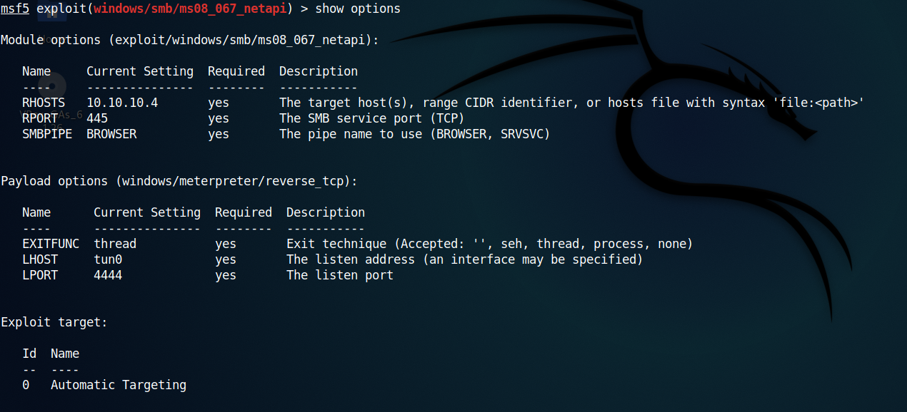
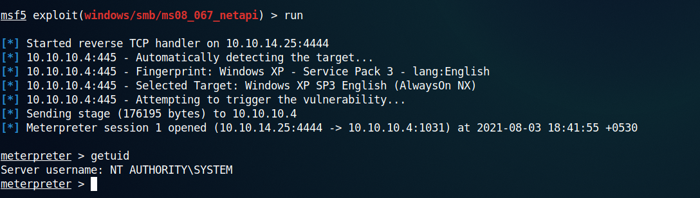
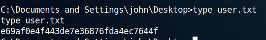
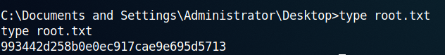

## Legacy
*Easy*

Used rustscan to find open ports.

To find the version of SMB I used metasploit.

I googled 'Windows XP SP3 (language:English)' and found [this](https://www.rapid7.com/db/modules/exploit/windows/smb/ms08_067_netapi/) article useful.

Ran the exploit.

We are the administrator.

User flag  **e69af0e4f443de7e36876fda4ec7644f**

Root flag  **993442d258b0e0ec917cae9e695d5713**
