## Mirai
*Easy*

Scanned for open prots with rustscan.

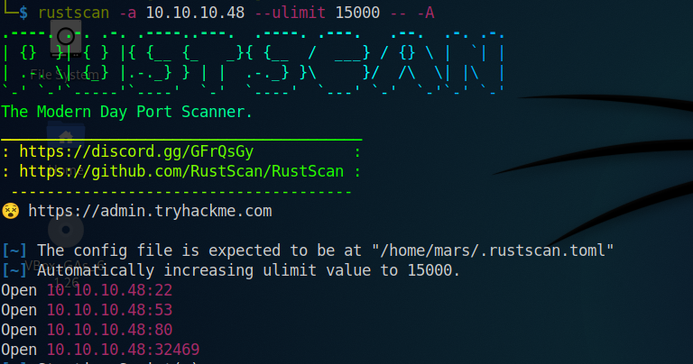

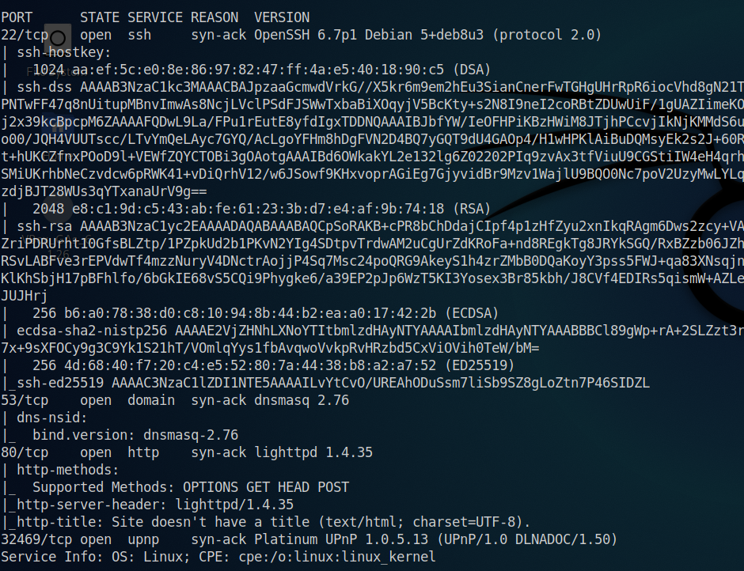

Used gobuster to eneumerate.

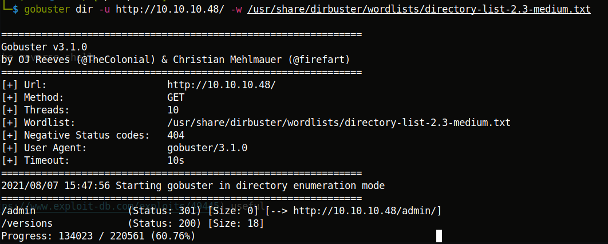

Found /admin interesting.

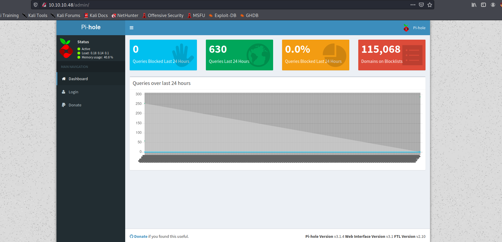

Notice the version of pi-hole at the bottom right.

As soon a I googled 'pi-hole' I found 'pi-hole version v3.14 exploit' and 'pi-hole version v3.14 default password'.

In the second search, it was given that the default credentials for login via ssh are 'pi:raspberry'. So I gave it a shot.

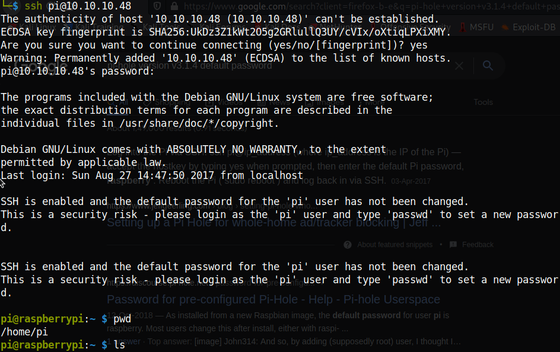

Thus I got the user flag.

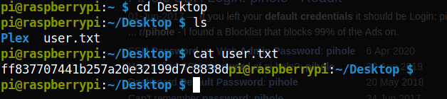

User flag  **ff837707441b257a20e32199d7c8838d**   

Searching for ways to become root, I tried 'sudo -l'

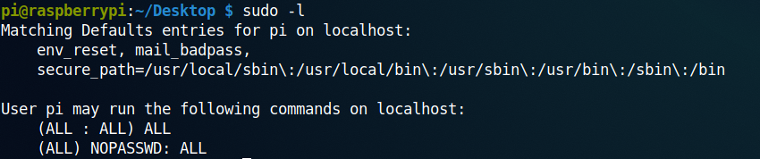

So I tried this.

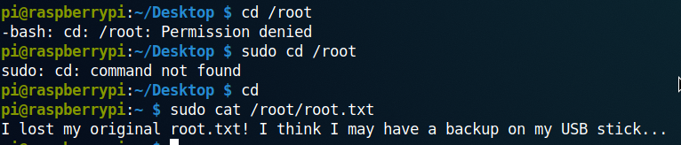

I then googled 'where is backup stored in linux'. The first response was /var/opt/mssql/data. But this location was not there in the machine. So I tried /var/www/html. There was a file called 'index.lighttpd.orig'. I opened it ad found something curious. I tried if it was the falg and it was!!!

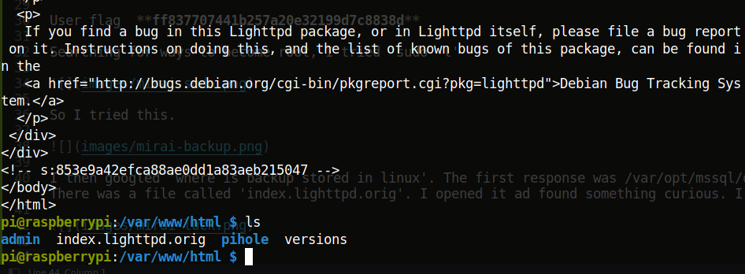

Root flag  **853e9a42efca88ae0dd1a83aeb215047**  

Then I tried to get the root flag authentically.

Used 'sudo su' and became the root. In the /media/usbstick there is a file 'damnit.txt'.

Using the command 'df -h' I found that /media/usbstick is mounted on /dev/sdb

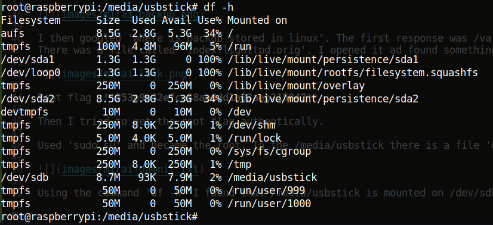

Used strings on /dev/sdb and found the flag.

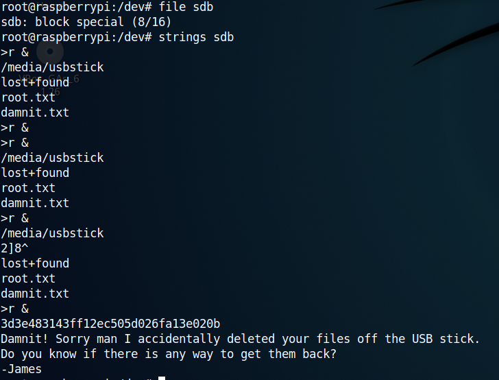

