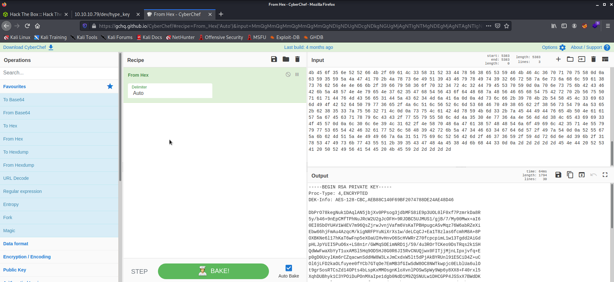

## Valentine
*Easy*

Port scanning using restscan


I opened the web page.


I then used gobuster.


I then opened /dev and found the file hype_key inetresting.


Then I used cyber chef to decode the hex data. I then got an RSA private key.



I then tried to get the password using john, but I wasen't successful.  
Not knowing what to do, I looked back at the webpage. I was a heart bleeding. So maybe, we need to use the heartbleed exploit :)


I used the first exploit I found.

```
python 32764.py 10.10.10.79 > result.txt
```
Found this piece of base64 in result.txt


On decoding I got 'heartbleedbelievethehype'. We can now decrypt the rsa private key using this password and login to ssh.


User falg  **e6710a5464769fd5fcd216e076961750**

Now for privilage escalation, I cannot use sudo -l because I don't know hype's password. So I lookes into his command history.


Notice the command "tmux -S /.devs/dev_sess". Root user was using this dev_sess as a session filefor tmux. Tmux is a terminal multiplexer. So when I ran the command I becane root.


Root flag **f1bb6d759df1f272914ebbc9ed7765b2**

